# 📚 Smart Library Management System (MySQL Project)

---

## 🚀 Project Overview
The **Smart Library Management System** is a fully structured SQL project designed to simulate real-world library operations.  
It manages books, authors, members, and transactions while enabling powerful data analysis using advanced SQL features.

This project demonstrates:
- CRUD Operations
- Filtering & Sorting
- Joins & Subqueries
- Aggregate Functions
- Window Functions
- CASE Expressions
- Date & String Manipulation

---

## 🎯 Objectives
- Efficiently manage library records 📖  
- Track borrowing and return activities 🔄  
- Analyze book demand and member behavior 📊  
- Apply advanced SQL concepts in practical scenarios  

---

# 🗄️ Database Schema

## 📌 Tables Included
1. Authors  
2. Books  
3. Members  
4. Transactions  

---

## ✍️ Authors Table
Stores author details such as name and email.

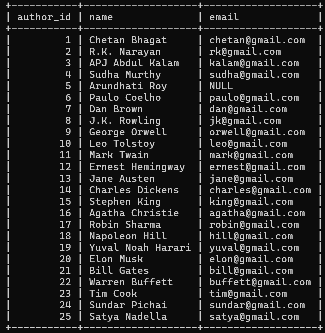

---

## 📖 Books Table
Contains book information including category, price, and availability.

---

## 👥 Members Table
Stores member personal and membership details.

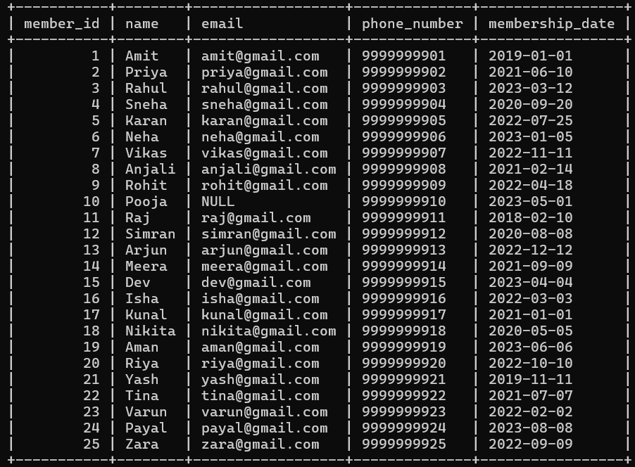

---

## 🔄 Transactions Table
Tracks borrowing, returning, and fines.

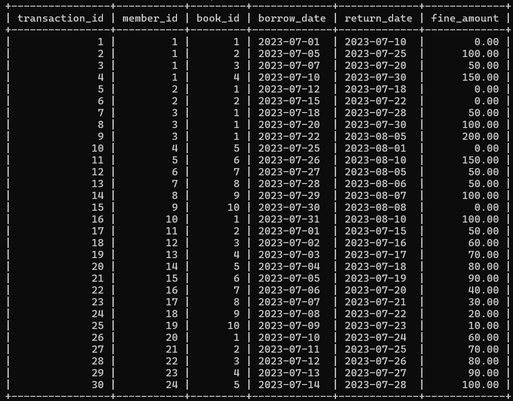

---

# 🔍 SQL Queries & Explanation

---

## 🔹 Q1. View All Books
Displays complete book records.

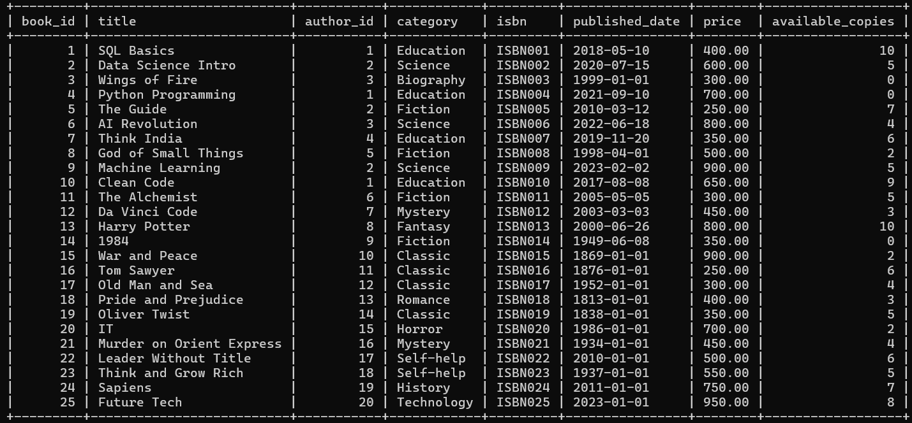

---

## 🔹 Q2. Books Published After 2015
Filters modern books based on publication date.

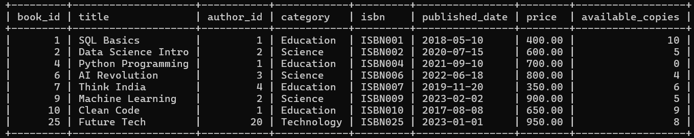

---

## 🔹 Q3. Top 5 Most Expensive Books
Sorts books by price and returns highest valued.

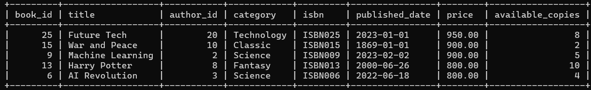

---

## 🔹 Q4. Members Joined Before 2022
Filters members based on membership date.

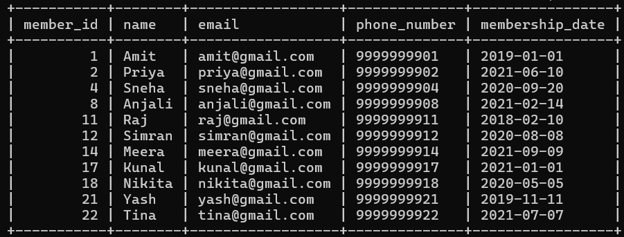

---

## 🔹 Q5. Books with Category = 'Science' AND Price < 500
Applies conditional filtering using AND operator.

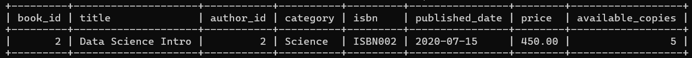

---

## 🔹 Q6. Books NOT Available for Borrowing
Identifies books with zero available copies.

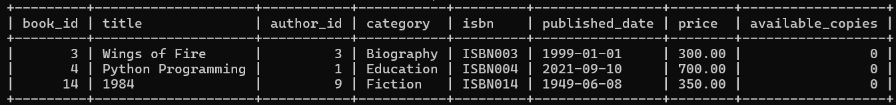

---

## 🔹 Q7. Members Joined After 2020 OR Borrowed Multiple Books
Uses OR condition for flexible filtering.

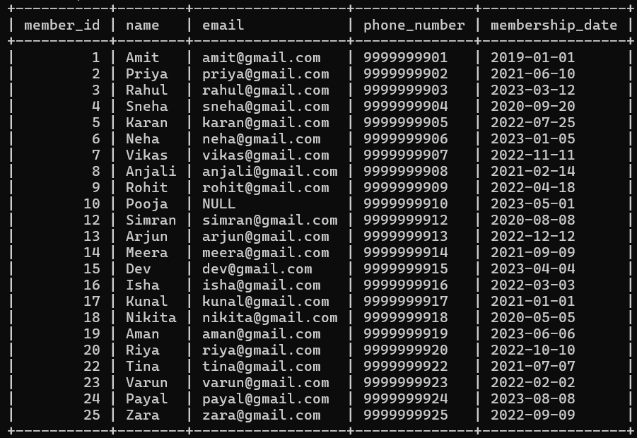

---

## 🔹 Q8. Books Sorted Alphabetically
Orders books using ORDER BY clause.

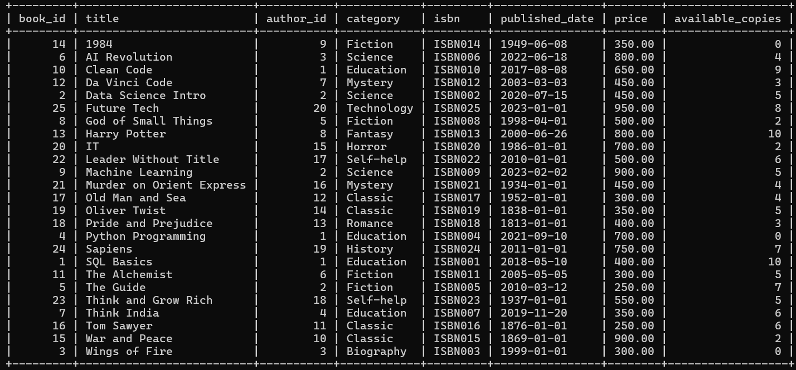

---

## 🔹 Q9. Number of Books Borrowed by Each Member
Uses GROUP BY to analyze member activity.

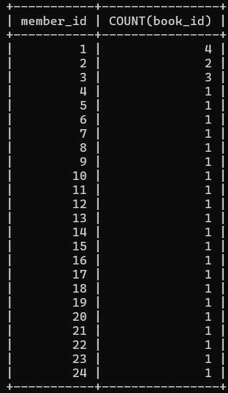

---

## 🔹 Q10. Total Books per Category
Counts number of books grouped by category.

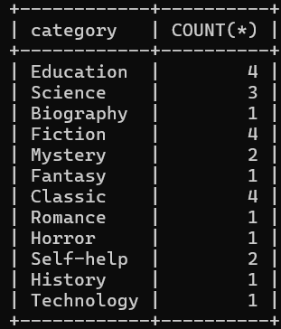

---

## 🔹 Q11. Average Book Price
Calculates average price using AVG().

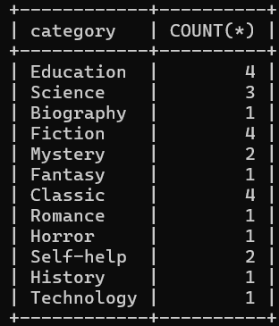

---

## 🔹 Q12. Most Borrowed Book
Identifies book with highest borrow count.

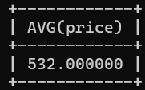

---

## 🔹 Q13. Total Fine Collected
Calculates total fines using SUM().

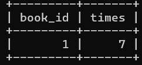

---

## 🔹 Q14. Books with Author Names (INNER JOIN)
Combines books and authors data.

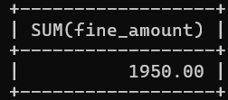

---

## 🔹 Q15. Members and Borrowed Books (LEFT JOIN)
Displays all members including those without transactions.

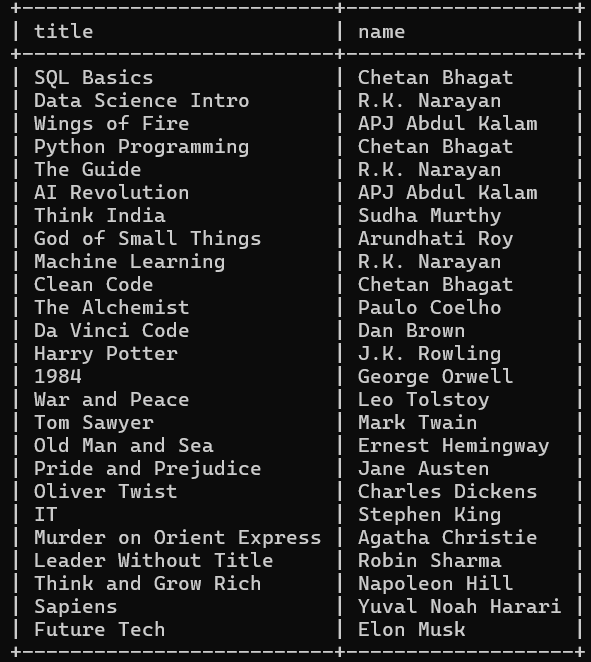

---

## 🔹 Q16. Members Who Never Borrowed Books
Uses NULL filtering to find inactive members.

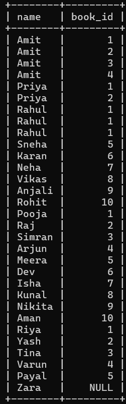

---

## 🔹 Q17. Books Borrowed by Members (Subquery)
Filters books based on borrowing conditions.

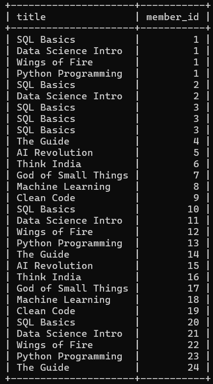

---

## 🔹 Q18. Extract Year from Published Date
Uses YEAR() function for analysis.

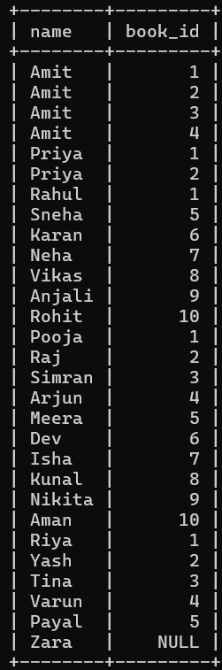

---

## 🔹 Q19. Calculate Borrow Duration (DATEDIFF)
Finds difference between borrow and return dates.

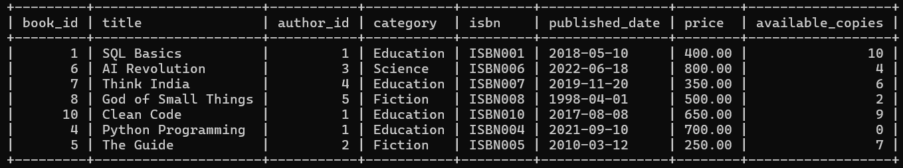

---

## 🔹 Q20. Format Borrow Date
Converts date into readable format.

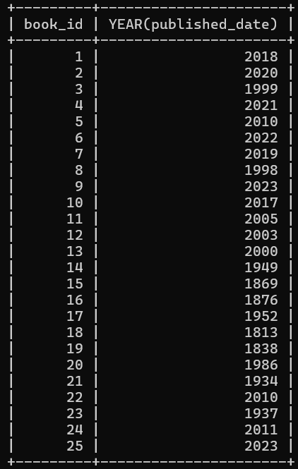

---

## 🔹 Q21. Convert Book Titles to Uppercase
Uses UPPER() string function.

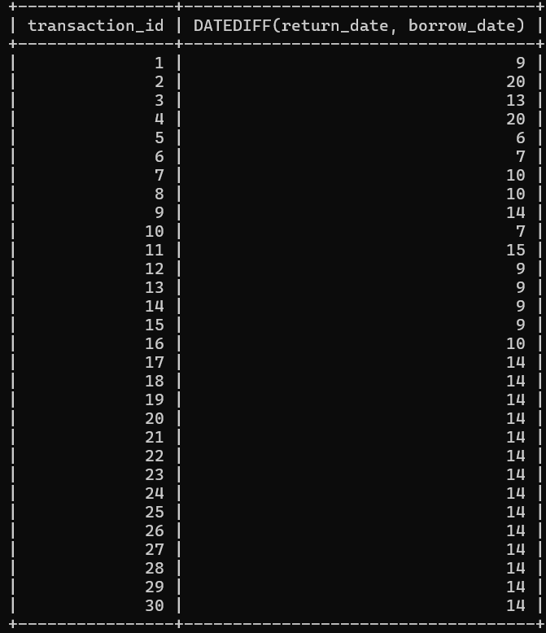

---

## 🔹 Q22. Trim Author Names
Removes unwanted spaces using TRIM().

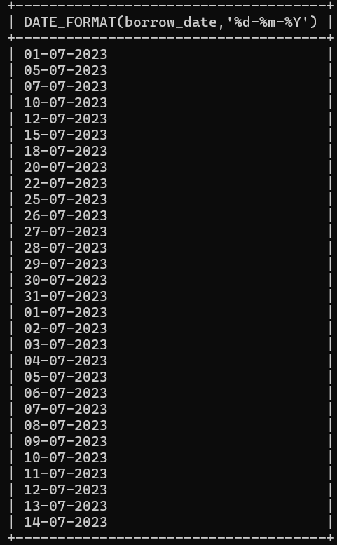

---

## 🔹 Q23. Replace NULL Emails
Handles missing values using IFNULL().

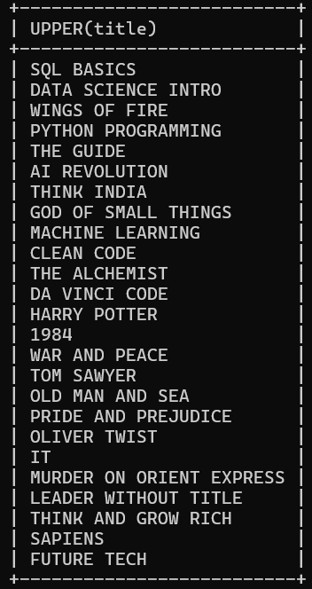

---

## 🔹 Q24. Rank Books by Borrow Count
Uses RANK() window function.

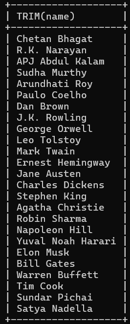

---

## 🔹 Q25. Running Borrow Count per Member
Uses window function with PARTITION BY.

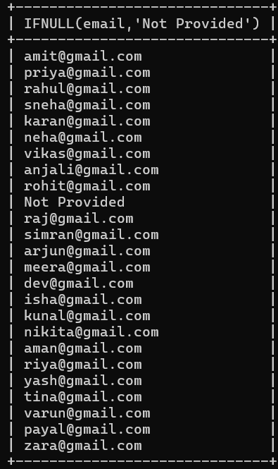

---

## 🔹 Q26. Member Activity Status (CASE)
Classifies members as Active/Inactive.

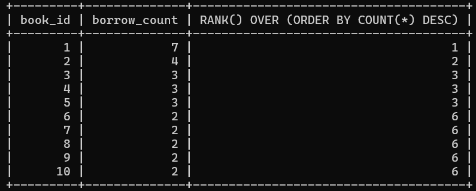

---

## 🔹 Q27. Categorize Books (CASE)
Classifies books as:
- New Arrival  
- Classic  
- Regular  

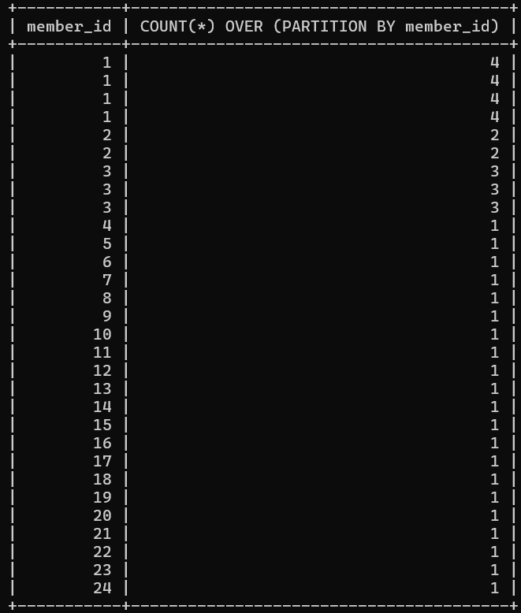

---

# 🛠️ Work Done in This SQL Project

---

## 🏗️ Database Design
- Designed a structured **Library Management System** database  
- Created relational tables:
  - 📖 Books  
  - ✍️ Authors  
  - 👥 Members  
  - 🔄 Transactions  
- Implemented:
  - 🔑 Primary Keys (unique identification)  
  - 🔗 Foreign Keys (table relationships)  

---

## 📥 Data Creation & Management
- Inserted **25+ realistic records** into each table  
- Maintained proper relationships between data  
- Handled missing values using **NULL handling techniques**  

---

## 🔄 CRUD Operations
- Performed all basic operations:
  - ➕ Insert new records  
  - 📖 Retrieve data  
  - ✏️ Update existing records  
  - ❌ Delete unwanted records  

---

## 🔍 Data Filtering & Conditions
- Applied SQL clauses:
  - `WHERE`, `AND`, `OR`, `NOT`  
- Filtered:
  - Books by category and price  
  - Members by joining date  
  - Availability of books  

---

## 📊 Sorting & Grouping
- Used:
  - `ORDER BY` → sorting data  
  - `GROUP BY` → grouping records  
- Analyzed:
  - Books per category  
  - Borrow count per member  

---

## 📈 Aggregate Functions
- Implemented:
  - `SUM()` → total fines collected  
  - `AVG()` → average book price  
  - `COUNT()` → number of records  
  - `MAX()` → most borrowed book  

---

## 🔗 Joins Implementation
- Applied multiple joins:
  - 🔹 INNER JOIN → books with authors  
  - 🔹 LEFT JOIN → all members with transactions  
  - 🔹 RIGHT JOIN → books not borrowed  
  - 🔹 FULL JOIN (conceptual)  

---

## 🧠 Subqueries
- Used subqueries to:
  - Find most borrowed books  
  - Identify inactive members  
  - Filter complex conditions  

---

## 📅 Date Functions
- Used:
  - `YEAR()` → extract year  
  - `DATEDIFF()` → calculate borrow duration  
  - `DATE_FORMAT()` → format dates  

---

## 🔤 String Functions
- Implemented:
  - `UPPER()` → convert titles to uppercase  
  - `TRIM()` → clean extra spaces  
  - `IFNULL()` → replace missing values  

---

## ⚡ Window Functions
- Applied advanced functions:
  - `RANK()` → rank books by popularity  
  - `PARTITION BY` → member-wise analysis  

---

## 🎯 CASE Expressions
- Created conditional logic:
  - Member status → Active / Inactive  
  - Book category → New / Classic / Regular  

---

## 📊 Data Analysis & Insights
- Identified:
  - 📚 Most borrowed books  
  - 👤 Active vs inactive members  
  - 💰 Total fines collected  
  - 📈 Category-wise distribution  

---

## 🚀 Final Outcome
- Built a **fully functional SQL-based system**  
- Demonstrated real-world database handling  
- Applied **advanced SQL concepts in practical scenarios**  

---

## 💡 Summary
> This project showcases complete SQL proficiency from database design to advanced data analysis.

---

# 🧠 Key Learnings

- Mastered relational database design  
- Applied real-world SQL problem solving  
- Understood advanced SQL concepts deeply  
- Learned data analysis using queries  

---

# 🏁 Conclusion

This project successfully demonstrates how SQL can be used to build a complete **Library Management System** with powerful analytics and real-world usability.

---

## 💡 Author
**Dhrukesh** 🚀  
SQL Project Developer  

---

## ⭐ Final Note
> “Bring on your coding attitude!” 💪🔥
